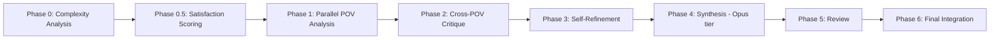

# RunPod Serverless Deliberator with DeepSeek

Convert the T00L Deliberator multi-perspective reasoning engine to a RunPod Serverless worker using DeepSeek models instead of Claude CLI.

---

## Overview

The Deliberator is a sophisticated multi-perspective AI reasoning system that:
1. Dynamically generates 5-30 expert personas based on question complexity
2. Runs parallel analyses across all personas
3. Cross-critiques between personas (each expert critiques all others)
4. Self-refinement based on received critiques
5. Synthesizes a consensus answer with self-critique sections

**Current Implementation**: Node.js CLI spawning Claude CLI processes via Antigravity proxy  
**Target Implementation**: Python RunPod Serverless handler using DeepSeek API directly

---

## Source Architecture Reference

### Core Files
| File | Lines | Purpose |
|------|-------|---------|
| [deliberate.js](file:///c:/Users/yannp/.gemini/antigravity/Global%20Knowledge/Tools/The%20Deliberator/deliberate.js) | 1006 | Main orchestrator, CLI args, job persistence |
| [phase-runner.js](file:///c:/Users/yannp/.gemini/antigravity/Global%20Knowledge/Tools/The%20Deliberator/lib/phase-runner.js) | 587 | Model execution, parallel batching, prompt builders |
| [synthesizer.js](file:///c:/Users/yannp/.gemini/antigravity/Global%20Knowledge/Tools/The%20Deliberator/lib/synthesizer.js) | ~200 | Final synthesis and revision integration |
| [complexity-analyzer.js](file:///c:/Users/yannp/.gemini/antigravity/Global%20Knowledge/Tools/The%20Deliberator/lib/complexity-analyzer.js) | ~150 | Determines optimal POV count from question |
| [extended-personas.js](file:///c:/Users/yannp/.gemini/antigravity/Global%20Knowledge/Tools/The%20Deliberator/lib/extended-personas.js) | ~300 | Fallback persona definitions |

### Existing T00L Specs
- [follow-ups.md](file:///c:/Users/yannp/.gemini/antigravity/Global%20Knowledge/Tools/T00L/specs/follow-ups.md) — Job chaining for re-deliberation
- [error-handling.md](file:///c:/Users/yannp/.gemini/antigravity/Global%20Knowledge/Tools/T00L/specs/error-handling.md) — Resilience patterns
- [resume.md](file:///c:/Users/yannp/.gemini/antigravity/Global%20Knowledge/Tools/T00L/specs/resume.md) — Checkpoint/resume logic

---

## Pipeline Phases (Port 1:1)



### Phase Weights (for progress calculation)
```python
PHASE_WEIGHTS = {
    'preflight': 2,
    'complexity': 3,
    'satisfaction': 5,
    'analysis': 25,
    'critique': 25,
    'refinement': 20,
    'synthesis': 12,
    'review': 5,
    'integration': 3
}
```

---

## DeepSeek Model Mapping

> [!IMPORTANT]
> The current system uses Claude models via proxy. Migrate to DeepSeek equivalents:

| Original Role | Claude Model | DeepSeek Equivalent | Notes |
|---------------|--------------|---------------------|-------|
| Analysis/Critique/Refinement/Review | sonnet | `deepseek-chat` | Fast, GPT-4 class |
| Quality checks (trite filter) | haiku | `deepseek-chat` | Cheapest tier |
| Synthesis (Phase 4) | opus | `deepseek-reasoner` | Highest quality reasoning |

### DeepSeek API Configuration
```python
# Environment variables
DEEPSEEK_API_KEY = os.environ["DEEPSEEK_API_KEY"]
DEEPSEEK_BASE_URL = "https://api.deepseek.com"

# Default parameters
DEFAULT_PARAMS = {
    "temperature": 0.7,
    "max_tokens": 4096,
    "stream": False,  # Bulk responses preferred for persistence
}
```

---

## RunPod Handler Structure

### Input Schema
```python
{
    "input": {
        "question": str,              # Required - the question to deliberate
        "pov_count": int | None,      # Optional override (5-30, default: auto from complexity)
        "loop_mode": bool,            # Iterate until 95% satisfaction (!!!LOOP)
        "context": str | None,        # Optional injected context
        "parent_job_id": str | None,  # For re-deliberation chains
        "resume_job_id": str | None,  # Resume from checkpoint
        "webhook_url": str | None,    # Callback URL for async completion
    }
}
```

### Output Schema
```python
{
    "output": {
        "job_id": str,
        "status": "complete" | "partial" | "failed",
        "result": str,                # Final synthesized answer (markdown)
        "details": {
            "personas": [...],        # Expert personas used
            "analyses": {...},        # Phase 1 outputs
            "critiques": {...},       # Phase 2 outputs
            "refinements": {...},     # Phase 3 outputs
            "satisfaction": {...},    # Cached confidence scores
            "duration_seconds": float,
            "iteration_count": int,
        },
        "checkpoint": {...} | None,   # For resumable failures
    }
}
```

---

## Key Implementation Details

### 1. Dynamic Persona Generation (Port from lines 524-578)

```python
async def generate_personas(question: str, pov_count: int) -> list[Persona]:
    """Generate dynamic expert personas tailored to the question."""
    prompt = f'''Analyze this question and suggest exactly {pov_count} unique expert perspectives...
    
    [FULL PROMPT FROM deliberate.js:525-546]
    '''
    
    response = await call_deepseek(prompt, model="deepseek-chat")
    
    # Parse JSON, fallback to static personas on failure
    try:
        return parse_personas(response)
    except:
        return FALLBACK_PERSONAS[:pov_count]
```

### 2. Parallel Execution Engine (Port from phase-runner.js:364-420)

```python
import asyncio
from typing import Callable

async def run_parallel(
    tasks: list[Task],
    max_concurrent: int = 5,
    on_progress: Callable | None = None
) -> list[Result]:
    """Execute tasks with concurrency limit and progress tracking."""
    semaphore = asyncio.Semaphore(max_concurrent)
    
    async def bounded_task(task):
        async with semaphore:
            return await execute_task(task)
    
    results = await asyncio.gather(*[bounded_task(t) for t in tasks])
    return results
```

### 3. Checkpoint/Resume System (Port from lines 86-114, 239-255)

```python
from dataclasses import dataclass, asdict
import json

@dataclass
class DeliberationCheckpoint:
    job_id: str
    question: str
    phase: str
    percent: int
    personas: list
    analyses: dict
    critiques: dict
    critiques_received: dict
    refinements: dict
    satisfaction: dict
    
    def save(self):
        # Store to RunPod volume or external storage (Supabase, S3)
        pass
    
    @classmethod
    def load(cls, job_id: str) -> "DeliberationCheckpoint":
        # Retrieve from storage
        pass
```

### 4. Anti-Trite Filter (Port from lines 737-792)

```python
async def filter_trite_analyses(analyses: list[Analysis], question: str) -> list[Analysis]:
    """Remove trivial/obvious analyses that don't add unique insight."""
    
    trite_check_prompt = '''Evaluate if this analysis provides GENUINE insight or is TRITE/OBVIOUS.
    
    Question: "{question}"
    Expert: {expert_name}
    Analysis (first 500 chars): "{analysis_preview}"
    
    Respond with ONLY valid JSON (no markdown):
    {"isTrite": true/false, "reason": "brief 1-sentence explanation"}
    '''
    
    # Use cheapest model for trite checks
    checks = await run_parallel([
        Task(id=a.id, prompt=trite_check_prompt.format(...), model="deepseek-chat")
        for a in analyses
    ])
    
    return [a for a in analyses if not checks[a.id].is_trite]
```

### 5. Synthesis with Self-Critique (Phase 4-6)

```python
async def synthesize(
    question: str,
    refinements: list[Refinement],
    personas: list[Persona]
) -> str:
    """Compile final answer with consensus, tensions, and self-critique."""
    
    # Phase 4: Use highest-tier model for synthesis
    compilation = await call_deepseek(
        build_synthesis_prompt(question, refinements),
        model="deepseek-reasoner"  # Best reasoning model
    )
    
    # Phase 5: All experts review synthesis
    reviews = await run_parallel([
        Task(id=p.id, prompt=build_review_prompt(p, question, compilation))
        for p in personas
    ])
    
    # Phase 6: Integrate revisions from experts who flagged NEEDS_REVISION
    revisions_needed = [r for r in reviews if "NEEDS_REVISION" in r.result]
    if revisions_needed:
        return await integrate_revisions(question, compilation, reviews)
    
    return compilation
```

---

## Progress Webhook Format

When `webhook_url` is provided, send progress updates:

```json
{
    "job_id": "delib-1234567890",
    "phase": "critique",
    "total_percent": 45,
    "phase_percent": 40,
    "status": "running",
    "current_task": "systems_architect",
    "timestamp": "2026-01-19T03:00:00Z"
}
```

---

## Error Handling & Resilience

### Retry Strategy (from phase-runner.js:24)
```python
RETRY_DELAYS = [2, 4, 8, 10, 15]  # seconds, exponential backoff

async def call_deepseek_with_retry(prompt: str, model: str) -> str:
    last_error = None
    for i, delay in enumerate(RETRY_DELAYS):
        try:
            return await call_deepseek(prompt, model)
        except Exception as e:
            last_error = e
            if i < len(RETRY_DELAYS) - 1:
                await asyncio.sleep(delay)
    raise RuntimeError(f"All retries exhausted: {last_error}")
```

### Graceful Degradation
- If persona generation fails → Use fallback static personas
- If a single POV analysis fails → Continue with remaining POVs
- If synthesis fails → Return partial results with checkpoint
- Always save checkpoint before known long operations

---

## Dockerfile Skeleton

```dockerfile
FROM python:3.11-slim

WORKDIR /app

# Install dependencies
COPY requirements.txt .
RUN pip install --no-cache-dir -r requirements.txt

# Copy handler code
COPY handler.py .
COPY lib/ ./lib/

# RunPod serverless entry
CMD ["python", "-u", "handler.py"]
```

### requirements.txt
```
runpod
httpx
pydantic
```

---

## Testing Strategy

### Local Testing
```python
# Test with RunPod local runner
if __name__ == "__main__":
    import runpod
    runpod.serverless.start({"handler": handler})
```

### Integration Tests
1. **Minimal question**: "What is 2+2?" → Verify low POV count (5)
2. **Complex question**: "Design a distributed database for petabyte scale" → Verify high POV count (20+)
3. **Resume test**: Interrupt mid-analysis, verify checkpoint, resume completes
4. **Loop mode**: "!!!LOOP Should I use microservices?" → Verify iteration until convergence

---

## Migration Checklist

- [ ] Port `complexity-analyzer.js` → `lib/complexity.py`
- [ ] Port `extended-personas.js` → `lib/personas.py` (fallbacks only)
- [ ] Port prompt builders from `phase-runner.js` → `lib/prompts.py`
- [ ] Port `synthesizer.js` → `lib/synthesis.py`
- [ ] Implement `handler.py` main entrypoint
- [ ] Implement checkpoint storage (Supabase recommended for persistence across cold starts)
- [ ] Add webhook progress reporting
- [ ] Docker build + RunPod deployment
- [ ] End-to-end integration tests

---

## Notes for Implementing Agent

> [!CAUTION]
> **Critical Behaviors to Preserve:**
> 1. The anti-trite filter is essential for quality — removes ~20% of low-value analyses
> 2. Satisfaction scoring (Phase 0.5) is cached and used for !!!LOOP convergence
> 3. Cross-critique means EVERY persona critiques EVERY OTHER persona (N×(N-1) interactions)
> 4. Phase 4 MUST use highest-tier model (deepseek-reasoner) for synthesis quality
> 5. Checkpoint saves must occur BEFORE long operations, not after

> [!TIP]
> **Optimization Opportunities:**
> 1. DeepSeek API supports batch endpoints — could batch all Phase 1 analyses in single call
> 2. Consider caching persona generation for similar questions
> 3. For !!!LOOP mode, implement early exit if satisfaction trends are flat
